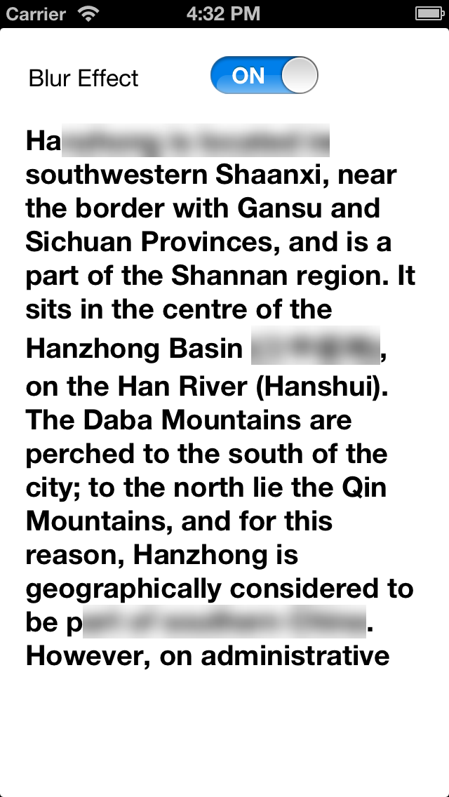

WKBlurTextView
==============

Purpose
--------------
subClass of UITextView can Blur part of texts inside textView.

Supported iOS & SDK Versions
-----------------------------
Support iOS 6+.

3rd Library
--------------------
Use FXBlurView (https://github.com/nicklockwood/FXBlurView) to Implement Blur effect.

WKBlurTextView methods
-----------------------
  
`
- (void)blurText:(NSString *)blurText;
`

blur text by string.
  
`
- (void)blurTexts:(NSArray *)texts;
`

blur text by array of strings.
  
`
- (void)blurRange:(NSRange)range;
`

blur text by NSRange.

Preview Image
-----------------

Release Notes
-----------------

Version 1.0

- Initial release